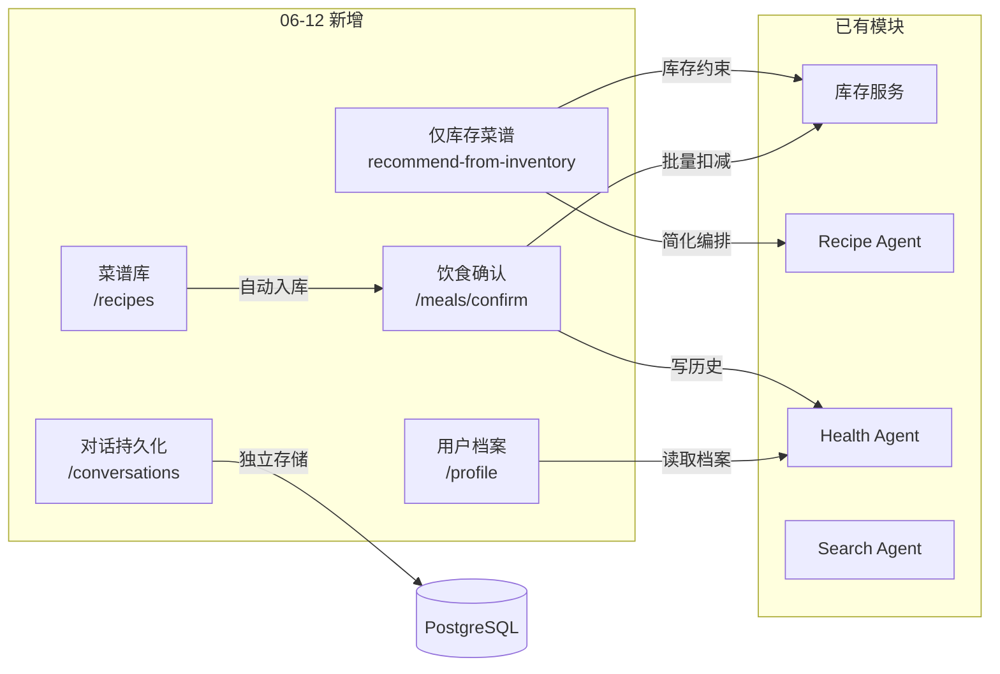

# 06-12 功能变更总览

> 更新时间: 2026-06-12

本文档是 2026-06-12 当天所有未同步到 GitHub 的功能变更入口。每个子文档覆盖一个独立模块。

## 变更速览

| 序号 | 模块 | 类型 | 核心变更 |
|------|------|------|----------|
| 1 | [仅库存菜谱生成](./仅库存菜谱生成.md) | 🆕 新功能 | 基于真实库存约束的 LLM 菜谱生成，跳过搜索记忆和厨具检查 |
| 2 | [饮食确认与数据闭环](./饮食确认与数据闭环.md) | 🆕 新功能 | 确认制作 → 批量扣库存 → 饮食历史 → 菜谱自动入库 全链路 |
| 3 | [对话持久化](./对话持久化.md) | 🆕 新功能 | 对话历史按 user_id + date 保存/加载，解决页面切换消息丢失 |
| 4 | [用户健康档案](./用户健康档案.md) | 🆕 新功能 | UserProfile 存储身高体重等指标，HealthAgent 自动读取 |
| 5 | [菜谱库](./菜谱库.md) | 🆕 新功能 | 确认过的菜谱自动入库，支持搜索和 Top N 排行 |
| 6 | [Agent 编排增强](./Agent编排增强.md) | 🔧 增强 | Recipe Graph 增加厨具检查和结果汇总节点；Health Agent 注入饮食历史+档案 |
| 7 | [数据库迁移说明](./数据库迁移说明.md) | 🏗 基础设施 | 5 次 Alembic 迁移（04~08），新增 3 张表、2 次表结构变更 |
| 8 | [API 变更汇总](./API变更汇总.md) | 📋 参考 | 所有新增/变更端点速查表 |

## 架构影响

## 数据库变更

| 迁移 | 操作 | 说明 |
|------|------|------|
| `20260612_04` | CREATE | `meal_history` + `conversations` |
| `20260612_05` | CREATE | `user_profiles` |
| `20260612_06` | CREATE | `recipes` |
| `20260612_07` | ALTER | `inventories` 增加 `user_id` 列 |
| `20260612_08` | ALTER | `meal_history` 增加 `deducted_detail` + `rolled_back_at` 列 |

## 关联文档

- 已有进度记录: `docs/数据闭环实施进度.md`
- 架构设计: `docs/设计文档.md`
- 开发进度: `docs/后端开发进度与待办.md`
- 项目现状: `docs/项目开发现状总览.md`
