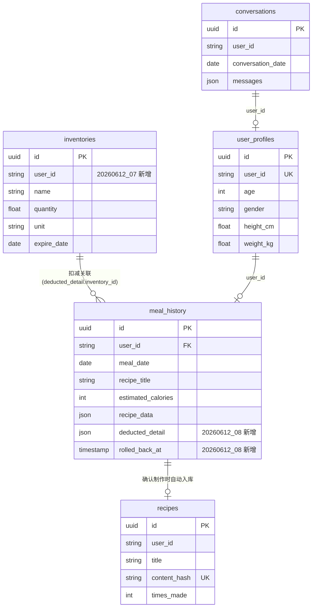

# 数据库迁移说明

> 更新时间: 2026-06-12

## 1. 迁移清单

2026-06-12 共执行 5 次 Alembic 迁移：

| 迁移 ID | 操作 | 目标表 | 说明 |
|---------|------|--------|------|
| `20260612_04` | CREATE | `meal_history` + `conversations` | 饮食记录 + 对话持久化 |
| `20260612_05` | CREATE | `user_profiles` | 用户健康档案 |
| `20260612_06` | CREATE | `recipes` | 菜谱库 |
| `20260612_07` | ALTER | `inventories` | 增加 `user_id` 列 |
| `20260612_08` | ALTER | `meal_history` | 增加 `deducted_detail` + `rolled_back_at` 列 |

## 2. 迁移依赖链

```
20260611_03 (celery_task_execution_logs)
    └── 20260612_04 (meal_history + conversations)  ← 无表依赖
         └── 20260612_05 (user_profiles)             ← 无表依赖
              └── 20260612_06 (recipes)              ← 无表依赖
                   └── 20260612_07 (inventories +user_id)  ← ALTER 已有表
                        └── 20260612_08 (meal_history +列)  ← ALTER 已有表
```

## 3. 表结构 DDL

### 3.1 `meal_history`

```sql
CREATE TABLE meal_history (
    id              UUID PRIMARY KEY,
    user_id         VARCHAR(64) NOT NULL,
    meal_date       DATE NOT NULL,
    recipe_title    VARCHAR(200) NOT NULL,
    estimated_calories INTEGER DEFAULT 0,
    recipe_data     JSON,
    deducted_detail JSON,           -- 20260612_08 新增
    rolled_back_at  TIMESTAMPTZ,    -- 20260612_08 新增
    confirmed_at    TIMESTAMPTZ NOT NULL,
    created_at      TIMESTAMPTZ NOT NULL,
    updated_at      TIMESTAMPTZ NOT NULL
);
CREATE INDEX ix_meal_history_user_id ON meal_history(user_id);
CREATE INDEX ix_meal_history_meal_date ON meal_history(meal_date);
```

### 3.2 `conversations`

```sql
CREATE TABLE conversations (
    id                UUID PRIMARY KEY,
    user_id           VARCHAR(64) NOT NULL,
    conversation_date DATE NOT NULL,
    messages          JSON,
    last_active_at    TIMESTAMPTZ NOT NULL,
    created_at        TIMESTAMPTZ NOT NULL,
    updated_at        TIMESTAMPTZ NOT NULL
);
CREATE INDEX ix_conversations_user_id ON conversations(user_id);
```

### 3.3 `user_profiles`

```sql
CREATE TABLE user_profiles (
    id              UUID PRIMARY KEY,
    user_id         VARCHAR(64) NOT NULL UNIQUE,
    age             INTEGER,
    gender          VARCHAR(10),     -- male / female / other
    height_cm       FLOAT,
    weight_kg       FLOAT,
    activity_level  VARCHAR(20),     -- low / medium / high
    health_goal     VARCHAR(40),     -- lose_weight / maintain / gain_muscle
    created_at      TIMESTAMPTZ NOT NULL,
    updated_at      TIMESTAMPTZ NOT NULL
);
CREATE UNIQUE INDEX uq_user_profiles_user_id ON user_profiles(user_id);
CREATE INDEX ix_user_profiles_user_id ON user_profiles(user_id);
```

### 3.4 `recipes`

```sql
CREATE TABLE recipes (
    id                  UUID PRIMARY KEY,
    title               VARCHAR(200) NOT NULL,
    user_id             VARCHAR(64) NOT NULL,
    estimated_calories  INTEGER DEFAULT 0,
    ingredients         JSON,        -- [{name, amount, unit}]
    steps               JSON,        -- ["步骤1", "步骤2"]
    required_equipment  JSON,        -- ["pan", "pot"]
    recipe_data         JSON,        -- 完整 RecipeRecommendResponse
    times_made          INTEGER DEFAULT 1,
    content_hash        VARCHAR(32) NOT NULL,  -- MD5 去重指纹
    created_at          TIMESTAMPTZ NOT NULL,
    updated_at          TIMESTAMPTZ NOT NULL
);
CREATE INDEX ix_recipes_user_id ON recipes(user_id);
CREATE INDEX ix_recipes_content_hash ON recipes(content_hash);
```

### 3.5 `inventories` 变更 (20260612_07)

```sql
ALTER TABLE inventories ADD COLUMN user_id VARCHAR(64) NOT NULL DEFAULT 'default';
CREATE INDEX ix_inventories_user_id ON inventories(user_id);
```

**注意:** `server_default='default'` 仅用于迁移时填充已有行。新插入的行由应用层提供 `user_id`。

### 3.6 `meal_history` 变更 (20260612_08)

```sql
ALTER TABLE meal_history ADD COLUMN deducted_detail JSON;
ALTER TABLE meal_history ADD COLUMN rolled_back_at TIMESTAMPTZ;
```

## 4. ER 关系



## 5. 执行迁移

```bash
# 开发环境
alembic upgrade head

# Docker 环境
docker-compose run --rm migrate
```

## 6. 回滚

单个迁移回滚：
```bash
alembic downgrade -1   # 回退最近一次迁移
```

**注意:** 回退 `20260612_07`（inventories 增加 user_id）时，列中已有数据会丢失。生产环境不建议单独回退中间迁移。
