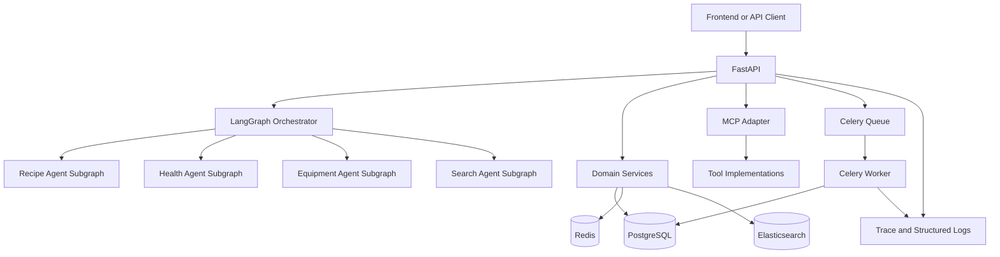
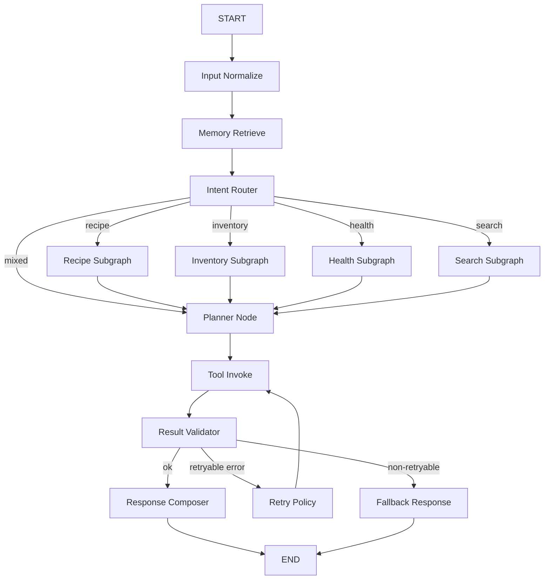
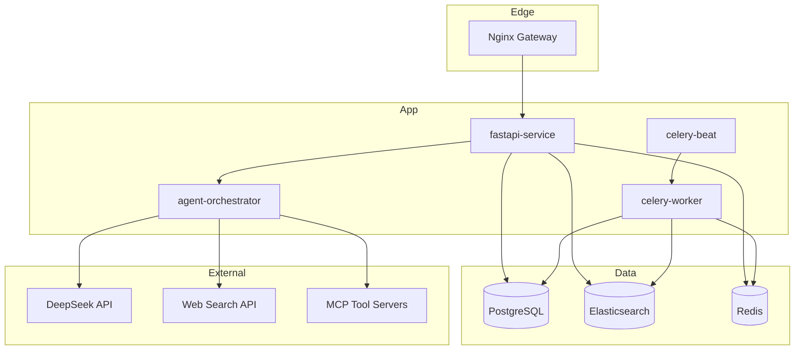

# Sebastian 设计文档

更新时间: 2026-06-11

## 1. 设计目标

Sebastian 是面向个人生活与厨房场景的多 Agent 系统。本设计文档聚焦三个目标:

1. 用统一架构支撑库存、聊天、搜索、MCP 与异步任务。
2. 保持“事务数据”和“检索数据”边界清晰。
3. 在 Dev Ready 阶段优先保证可运行、可回归、可排障。

## 2. 技术基线

- API: FastAPI
- 编排: LangGraph
- LLM: DeepSeek（默认 `deepseek-chat`）
- 事务数据库: PostgreSQL
- 检索与记忆: Elasticsearch
- 缓存与队列: Redis
- 异步任务: Celery
- 部署方式: Docker Compose

## 3. 系统架构

## 4. 核心设计边界

### 4.1 数据边界

1. PostgreSQL 是事务真相源（库存、任务、工具调用日志、任务执行日志）。
2. Elasticsearch 用于记忆检索与混合召回，不承担事务一致性。
3. Redis 用于短期状态缓存、限流窗口与队列，不承担长期审计。

### 4.2 编排边界

1. Inventory 主链路保持服务化处理，LangGraph 用于意图/响应编排。
2. 专用 Agent 通过独立子图暴露能力，API 层统一入口。
3. MCP adapter 负责协议抽象与错误分类，不耦合具体业务实现。

### 4.3 可观测边界

1. 请求入口生成或透传 `x-trace-id`。
2. trace_id 贯通 API、MCP、Agent、Celery 链路。
3. readiness 体现依赖可用性，不与 health 混淆。

## 5. 数据模型（当前实现）

当前已落地的核心表:

1. `inventories`
2. `inventory_transactions`
3. `agent_tasks`
4. `tool_call_logs`
5. `celery_task_execution_logs`

说明:

- 文档中的 users/recipe/nutrition 等领域表为后续扩展目标，暂未在当前代码落地。
- 数据模型权威来源以 `app/models/` 与 `alembic/versions/` 为准。

## 6. 检索设计（memory_index）

当前搜索能力集中在 memory_index:

1. 写入接口: `POST /api/search/memory`
2. 检索接口: `GET /api/search/memory`
3. 检索模式: `lexical` / `vector` / `hybrid`
4. 融合策略: RRF
5. Query Rewrite: 已启用关键词清洗与扩展
6. Embedding: 可配置 provider，默认 hash，支持 sentence-transformers 回退

## 7. 架构决策记录

1. 选择 DeepSeek 单模型策略
     - 目标是降低接入复杂度与调用成本，先保证稳定主链路。
2. 选择 LangGraph
     - 便于将 Inventory 与 Agent Tool 以子图方式演进，降低后续扩展风险。
3. 选择 PostgreSQL + Elasticsearch 分层
     - 事务一致性与语义检索能力分离，避免单存储承担冲突目标。
4. 选择 Redis + Celery
     - 用最小工程复杂度实现异步扫描、状态缓存、限流与队列。

## 8. 已知设计缺口（下一阶段）

1. 认证/鉴权仍为薄弱点（当前偏 Dev 场景）。
2. 前后端 E2E 自动化尚未完善。
3. 生产级指标与告警体系尚未接入。
4. 并发写入下的库存竞态策略需进一步强化。

## 9. 关联文档

- 运行与 API: `docs/使用指南.md`
- 部署与验收: `docs/部署完整指南.md`
- 测试与质量: `docs/测试与质量.md`
- 可观测: `docs/可观测性与监控.md`
- 进度与排期: `docs/开发进度与待办.md`

### 7.3 异常与降级策略
- 工具超时: 限次重试，超过阈值后返回保守建议
- 检索为空: 触发澄清问题或给出通用方案
- 模型拒答: 保留安全响应模板并提示可执行下一步
- 外部 API 失败: 使用缓存或本地知识库兜底

---

## 8. MCP（Model Context Protocol）工具接入方案

### 8.1 接入目标
通过 MCP 标准化工具协议，将库存、菜谱、健康、搜索等能力以独立工具服务形式接入 LangGraph。

### 8.2 工具服务划分
- inventory-mcp-server
- recipe-mcp-server
- health-mcp-server
- search-mcp-server

### 8.3 工具接口规范
每个 MCP Tool 至少定义以下字段:
- name
- description
- input_schema
- output_schema
- timeout_ms
- idempotency_key

### 8.4 调用链路
1. Agent 根据 Plan 选择工具。
2. Tool Adapter 生成 MCP 请求并附带 trace_id。
3. MCP Server 执行并返回结构化结果。
4. 结果写入 tool_call_logs，必要时回写 PostgreSQL 与 Elasticsearch。

### 8.5 鉴权与安全
- 服务间鉴权: JWT 或 mTLS
- 最小权限: 每类 Tool 仅开放必要动作
- 数据脱敏: 对 PII 字段执行脱敏日志记录
- 审计追踪: 全链路 trace_id 与请求摘要持久化

### 8.6 错误处理约定
- RETRYABLE_ERROR: 网络抖动、短暂超时
- VALIDATION_ERROR: 入参不合法，直接返回
- BUSINESS_ERROR: 业务规则冲突，返回可解释错误
- FATAL_ERROR: 系统不可用，触发熔断降级

---

## 9. Docker 微服务部署架构（Mermaid）

### 9.1 部署拓扑图

### 9.2 容器职责
- nginx: 统一入口、反向代理、限流
- fastapi-service: REST API、鉴权、请求编排
- agent-orchestrator: LangGraph 执行与 Tool Adapter
- celery-worker and celery-beat: 异步任务与定时任务
- postgres: 事务数据
- elasticsearch: 语义检索与知识召回
- redis: 队列与缓存

### 9.3 网络与存储
- 使用 app_net 和 data_net 双网络隔离
- PostgreSQL 与 Elasticsearch 使用持久化卷
- 应用容器仅读方式挂载配置文件

### 9.4 开发与生产差异
- 开发环境: 单机 Docker Compose，便于联调
- 生产环境: 分离日志与监控组件，启用副本与自动重启策略
- 生产建议: 使用镜像版本锁定与灰度发布

---

## 10. DeepSeek API 接入规范

### 10.1 配置项
- DEEPSEEK_API_KEY
- DEEPSEEK_BASE_URL
- DEEPSEEK_MODEL=deepseek-chat
- LLM_TIMEOUT_MS
- LLM_RETRY_MAX

### 10.2 调用策略
- 单模型策略用于 MVP，确保行为稳定与成本可控
- 设置统一超时与重试，避免阻塞主链路
- 对高风险输出增加规则校验节点

### 10.3 提示词治理
- 系统提示词按模块拆分并版本化
- 关键业务回复使用结构化输出约束
- 对工具调用结果先校验再入库

---

## 11. 非功能需求

### 11.1 性能
- P95 响应时间目标: 小于 3 秒（普通查询）
- 工具调用超时默认: 5 秒

### 11.2 可用性
- 服务可用性目标: 99.5%
- 关键容器启用健康检查与自动重启

### 11.3 安全性
- API Key 与密钥通过环境变量和密钥管理注入
- 数据分级与日志脱敏

### 11.4 可扩展性
- Agent 子图可插拔
- MCP 工具可按业务独立扩容

---

## 12. 里程碑与交付计划

### 12.1 MVP（第 1 阶段）
- 食谱推荐、库存管理、基础健康分析
- DeepSeek API 单模型接入
- PostgreSQL 和 Elasticsearch 联动

### 12.2 V1（第 2 阶段）
- 完整 MCP 工具接入
- 异步任务与提醒系统上线
- 增加监控与审计面板

### 12.3 V2（第 3 阶段）
- 多模态输入（图片/OCR）
- 智能采购与价格比较
- 多用户与权限体系

---

## 13. 项目预期成果
Sebastian 将从单轮问答助手升级为面向真实生活场景的可执行 Agent 系统，具备长期记忆、工具协同、事务与检索双存储、容器化部署和可持续扩展能力。