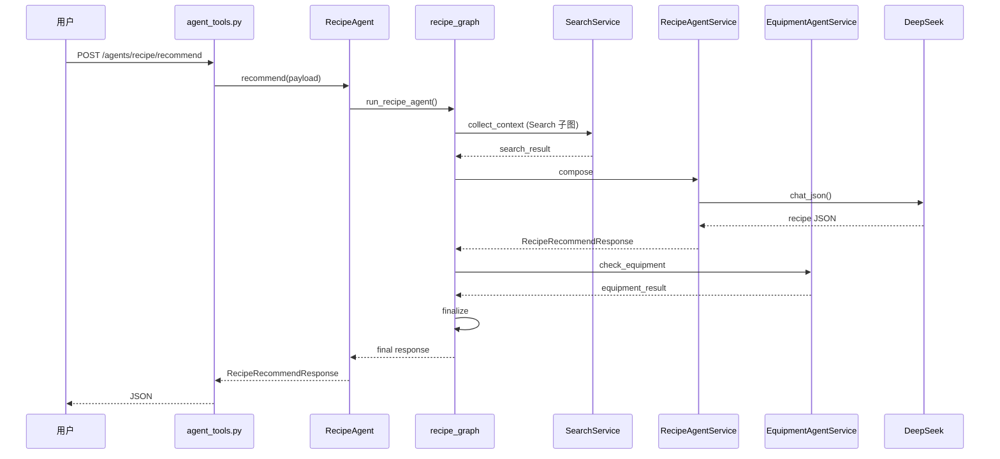

# 请求流程分析

> 最重要的一章：一次请求如何从 HTTP 到达数据库并返回。

## 总览

Sebastian 有三类典型请求路径：

1. **专用 Agent API** — 结构化输入，走 Agent → Graph → Service
2. **Inventory Chat** — 自然语言，走 LangGraph 意图编排
3. **Inventory CRUD** — 纯 Service，不经过 Agent

---

## 流程 1：生成菜谱（最复杂）

```
用户 / 前端
    |
    v
POST /api/agents/recipe/recommend
    |
    v
agent_tools.py :: recipe_recommend()
    |  (Depends 注入 RecipeAgent + InventoryService)
    v
RecipeAgent.recommend(payload)
    |
    v
run_recipe_agent()                    # orchestration/agent_graphs.py
    |
    +--[collect_context 节点]--------+
    |   Search 子图                    |
    |   SearchAgentService.answer()    |
    |   SearchService.search_memory()  |
    |   Elasticsearch                  |
    +----------------------------------+
    |
    +--[compose 节点]-----------------+
    |   RecipeAgentService.recommend() |
    |   get_llm_client().chat_json()   |  (有 API Key 时)
    |   或 _recommend_with_template()  |  (降级)
    +----------------------------------+
    |
    +--[check_equipment 节点]---------+
    |   EquipmentAgentService.check()  |
    +----------------------------------+
    |
    +--[finalize 节点]----------------+
    |   合并厨具校验结果到响应          |
    +----------------------------------+
    |
    v
RecipeRecommendResponse (JSON)
```

**关键源码位置：**

- API 入口：`app/api/routes/agent_tools.py` → `recipe_recommend()`
- Agent 门面：`app/agents/recipe_agent.py`
- 编排图：`app/orchestration/agent_graphs.py` → `_build_recipe_graph()`
- 业务逻辑：`app/services/recipe_agent_service.py`

**修改菜谱生成应该改哪里？**

| 改什么 | 文件 |
|--------|------|
| API 路径 / 参数 | `api/routes/agent_tools.py` + `schemas/agent_tools.py` |
| 流程顺序（如加 Health 节点） | `orchestration/agent_graphs.py` |
| 菜谱内容 / LLM Prompt | `services/recipe_agent_service.py` |
| 记忆检索逻辑 | `services/search_agent_service.py` |

---

## 流程 2：检查厨具

```
用户
    |
    v
POST /api/agents/equipment/check
    |
    v
EquipmentAgent.check(payload)
    |
    v
run_equipment_agent()                 # 单步 LangGraph
    |
    v
EquipmentAgentService.check()
    |  owned = set(equipment_owned)
    |  required = set(required_equipment)
    |  missing = required - owned
    v
EquipmentCheckResponse
```

**关键源码：**

- `app/agents/equipment_agent.py`
- `app/orchestration/agent_graphs.py` → `_build_equipment_graph()`
- `app/services/equipment_agent_service.py`

这是最简单的 Agent 链路：单节点 Graph，纯规则计算，不调用 LLM。

---

## 流程 3：Inventory 聊天

```
用户
    |
    v
POST /api/agent/chat
    |
    v
agent.py :: chat()
    |  创建 AgentTask 记录
    |  限流检查 (Redis)
    |  写入 tool_call_logs
    v
run_inventory_agent(message, user_id)  # orchestration/graph.py
    |
    +-- normalize_stage
    |     normalize_input()            # 去空格
    |
    +-- intent_stage
    |     classify_intent()            # LLM JSON 意图识别
    |     prompts.build_inventory_messages()
    |
    +-- response_stage
          compose_response() 或 fallback_response()
    |
    v
ChatResponse { reply, task_id }
```

**关键源码：**

- API + 任务落库：`app/api/routes/agent.py`
- 主图：`app/orchestration/graph.py`
- 节点：`app/orchestration/nodes.py`
- Prompt：`app/llm/prompts.py`

---

## 流程 4：库存 CRUD（无 Agent）

```
用户
    |
    v
POST /api/inventory
    |
    v
inventory.py :: create_inventory_item()
    |
    v
InventoryService.create_item()
    |
    v
PostgresInventoryRepository.create()
    |
    v
PostgreSQL (inventories 表)
```

**关键源码：**

- `app/api/routes/inventory.py`
- `app/services/inventory_service.py`
- `app/repositories/inventory.py`

---

## 流程 5：记忆搜索

```
用户
    |
    v
GET /api/search/memory?user_id=...&query=...
    |
    v
SearchService.search_memory()
    |
    v
Elasticsearch (memory_index)
    |  lexical / vector / hybrid (RRF)
    v
SearchResult
```

Agent 层的 Search 是对 SearchService 的封装，增加了摘要生成。

---

## 流程 6：MCP 工具调用

```
外部客户端
    |
    v
POST /api/mcp/invoke
    |
    v
MCPToolAdapter.invoke()
    |
    v
对应 Agent / Service 实现
```

MCP 是协议适配层，内部仍走 Agent/Service 链路。

---

## trace_id 贯穿

所有 API 请求经过 `main.py` 中的 middleware：

1. 读取或生成 `x-trace-id`
2. 写入 `request.state.trace_id`
3. 响应头返回 `x-trace-id`
4. 结构化访问日志记录 trace_id

排查问题时，用 trace_id 串联 API → Agent → Celery 日志。

---

## 时序图（Recipe 推荐）



更多架构图见 [images/README.md](./images/README.md)。
