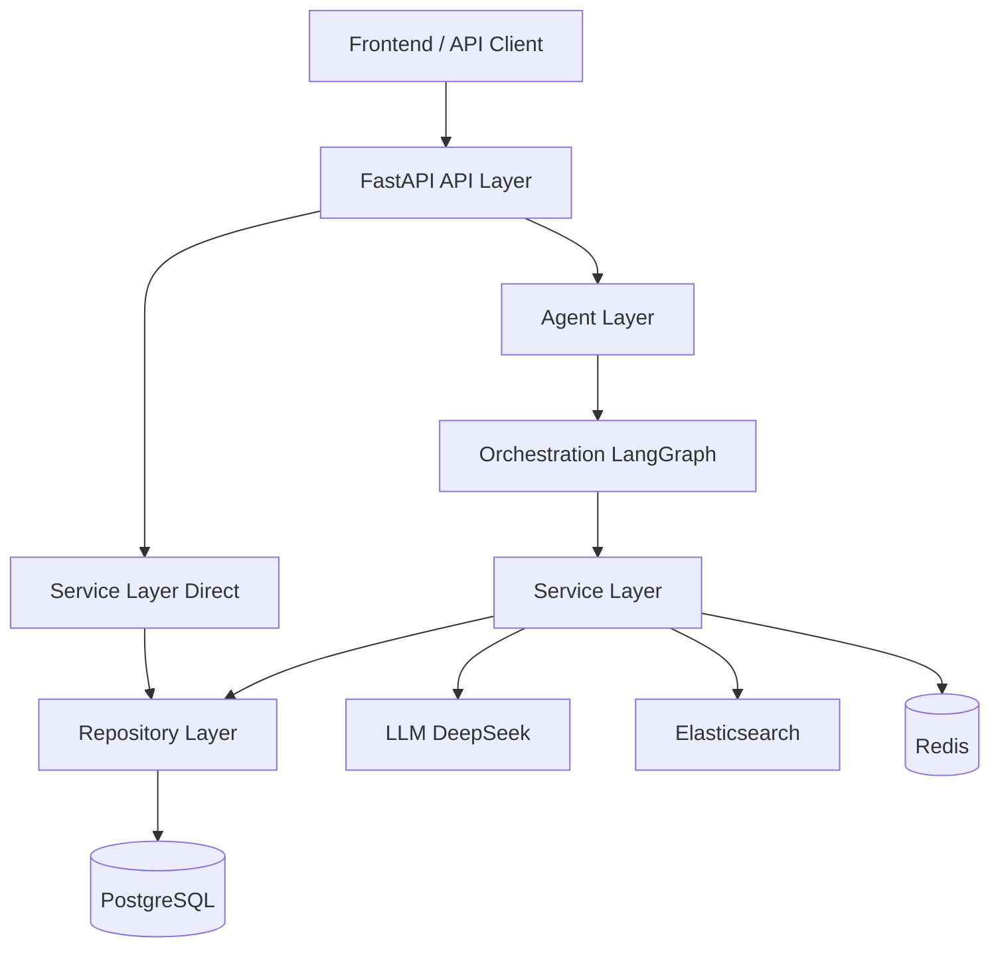
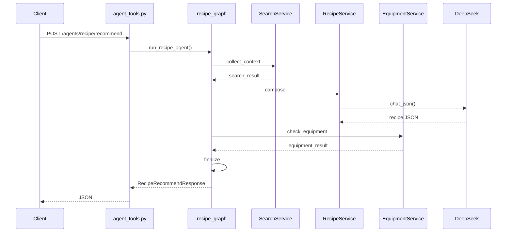
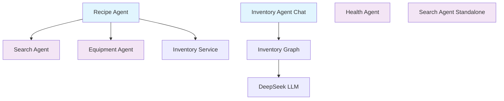
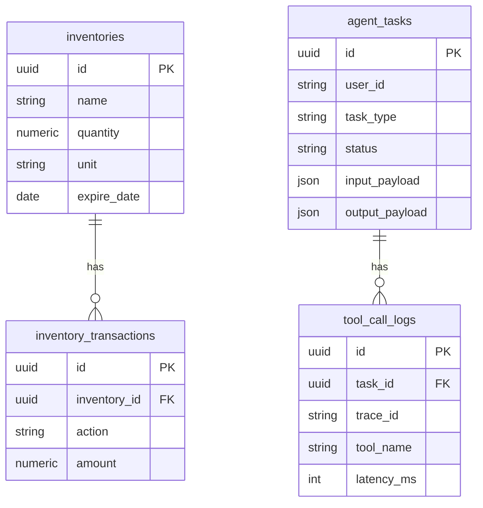

# 架构图资源

本目录存放项目架构的可视化图表。当前提供 Mermaid 源码，可导出为 PNG 供文档引用。

## 文件说明

| 文件 | 内容 | 状态 |
|------|------|------|
| `architecture.png` | 系统分层架构图 | 待导出 |
| `request_flow.png` | Recipe 请求流程时序图 | 待导出 |
| `agent_graph.png` | Agent 协作关系图 | 待导出 |
| `database.png` | 数据库 ER 图 | 待导出 |

## Mermaid 源码

### architecture — 系统分层



### request_flow — Recipe 推荐时序



### agent_graph — Agent 协作



### database — ER 关系



## 导出 PNG

使用 [Mermaid Live Editor](https://mermaid.live) 或 VS Code Mermaid 插件导出：

1. 复制上方 Mermaid 源码
2. 粘贴到编辑器
3. 导出 PNG/SVG
4. 保存到本目录

## 引用方式

在 Markdown 文档中：

```markdown

```

或使用 Mermaid 内联（GitHub / 部分 Markdown 渲染器支持）：

````markdown

````
